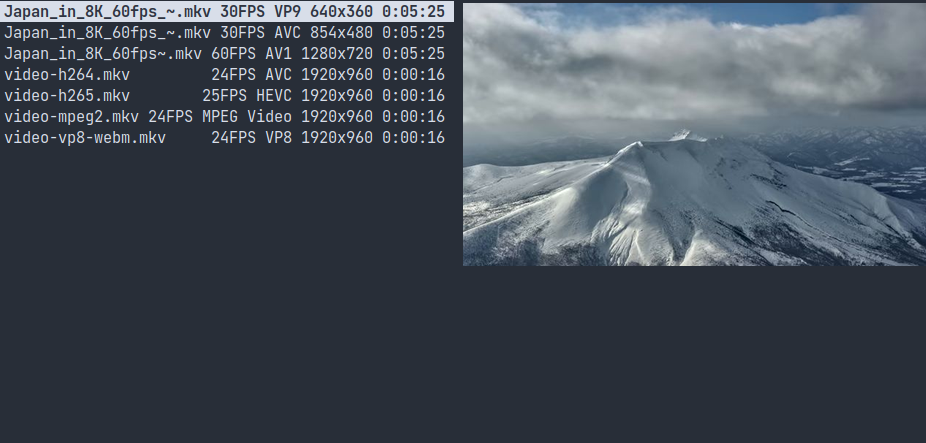

# Video information linemode for Ranger

Plugin to output a linemode with relevant information for videos, like the resolution,codec used or duration.



## Requirements

It uses Mediainfo to output the information from the videos, there might also be a ffprobe version later on but it was easier for me to make it work with Mediainfo.

## Install instructions

Place the mediainfo_linemode.py at:

```
~/.config/ranger/plugins
```

Then you can run it with: 

```
:linemode mediainfo
```

And add a keybind on your rc.conf, we can add it to the section of the other linemodes:

```
map Mv linemode mediainfo
```

## Configuration

You can choose what fields you want to output in the line by changing the line 85:  

```
return line_output(key_video,["FrameRate","Format","Height","Duration"])
```  

Delete the fields you don't want(the line might become too long) or change the order or add new onesby checking the output of mediainfo on a file and add anything from the video category:  

```
mediainfo --Output=JSON myvideofile
```

You can tweak some of the output in the line_output function, as an example the Height in line 45:

```
#output.append("%sx%s" % (new_dict.get("Width"," "),new_dict.get("Height"," ")))
output.append(str(new_dict.get(value," ")) + "P" ) # short,ex: 1080P
```

The first one outputs the width and height:

```
1920x1080
```

And the second just the height, which is handy to keep the line shorter:

```
1080P
```

So you can just comment the one you don't like.
